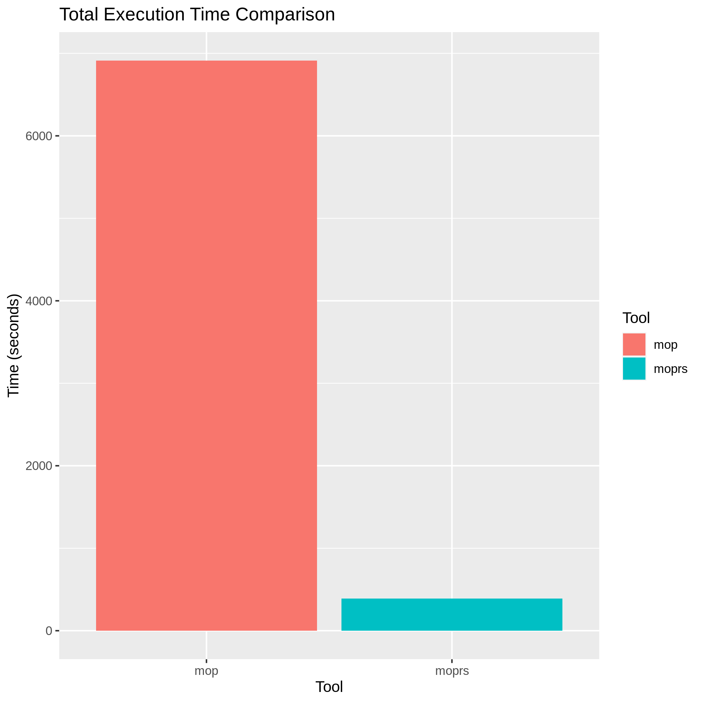
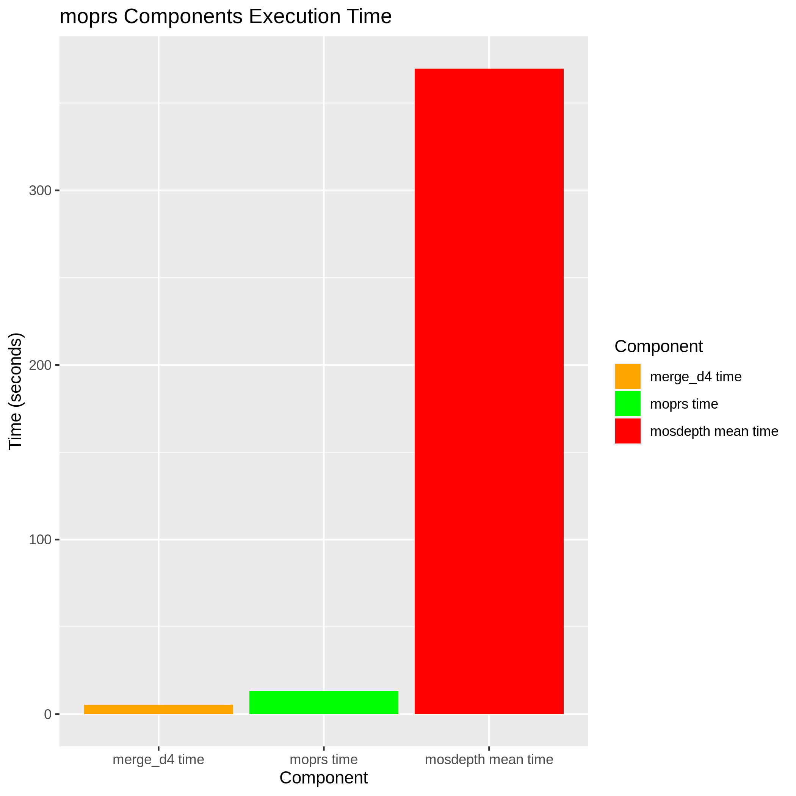

# moprs
Inspired by [mop](https://github.com/RILAB/mop), moprs identifies genomic regions across multiple samples with sufficient depth for genotyping (callable loci). moprs uses the [d4 format](https://github.com/38/d4-format) which results in much faster run times than traditional approaches using `samtools depth` and/or bed files. 

Currently, moprs only supports a single [d4](https://github.com/38/d4-format) file as input. Per sample d4 files can be created using [mosdepth](https://github.com/brentp/mosdepth), and then merged using `d4tools merge`.

## Installation
Binaries are available on the releases page. 

Alternatively, you can clone the repo and build from source using `cargo`:
```
cargo build --release -p moprs
```

## Usage
`moprs` accepts a single d4 file as input. Callable sites are written as bed format to stdout.
```
Calculates callable sites from depth statistics.

Usage: moprs [OPTIONS] <--d4 <D4_FILE>>

Options:
      --d4 <D4_FILE>
          The path to the D4 file
  -m, --min-depth <MIN_DEPTH>
          Minimum depth to consider site callable per individual [default: 0]
  -M, --max-depth <MAX_DEPTH>
          Maximum depth to consider site callable per individual [default: inf]
  -d, --depth-proportion <DEPTH_PROPORTION>
          Proporition of samples passing thresholds at site to consider callable [default: 1]
  -u, --min-mean-depth <MEAN_DEPTH_MIN>
          Minimum mean depth across all samples at site to consider callable [default: 0]
  -c, --output-counts
          Output number of individuals callable at site. EXPERIMENTAL v0.1.0
  -t, --threads <THREADS>
          Number of threads to use [default: 1]
  -h, --help
          Print help
  -V, --version
          Print version
```

## Contributing
If you would like to contribute, please feel free to fork the repo and open a PR. If you encounter any bugs or issues, please report them via the issues page.


## Performance
A benchmarking workflow is available in the `bench/` directory. Included is a small tool to simulate  BAMs and truth of callable regions. The workflow runs both mop and moprs on the same data. 

Below is a plot showing the time taken by each tool to process a dataset consisting of 5 BAM files, each representing a 500-megabase genome: 




*Note*: The time for moprs includes the mean time to run mosdepth for the 5 BAM files, as these runs are performed in parallel. Additionally, the moprs time accounts for merging the 5 D4 files using d4tools merge. Below shows the time for each step in the moprs workflow (mosdepth, d4tools, moprs).

